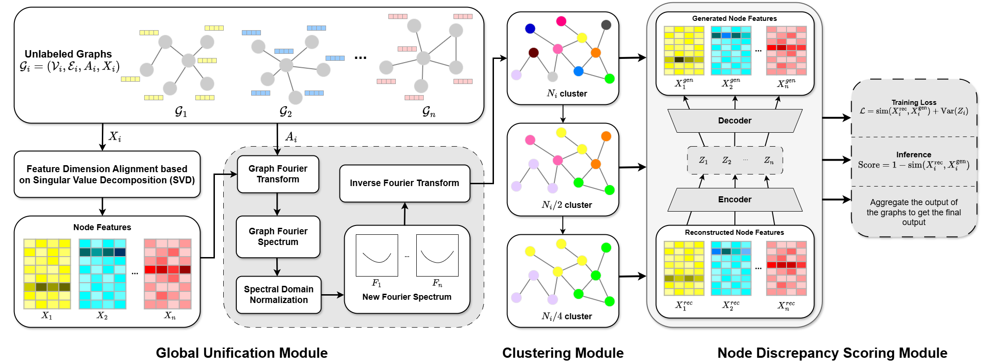
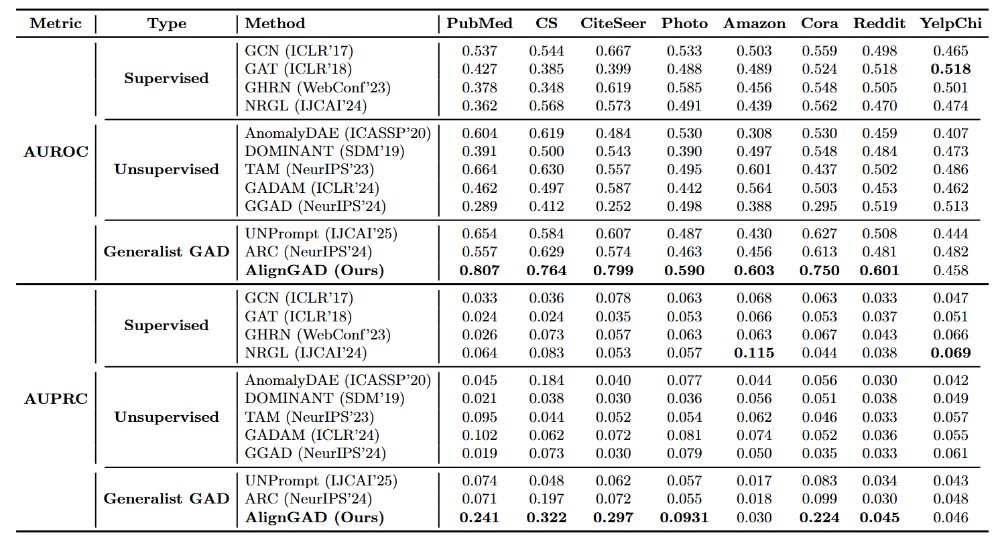

# [PRICAI '26] A Zero-shot Generalized Graph Anomaly Detection Framework via Node Reconstruction

## :sparkles: Introduction

This is the official repository for **AlignGAD**, accepted at **The Pacific Rim
International Conference on Artificial Intelligence (PRICAI) 2026**.

AlignGAD is designed for **zero-shot generalized graph anomaly detection**. In
this setting, a model learns from source graphs and is then asked to detect
anomalies on unseen target graphs, without training on the target domain.

Our motivation is simple: node reconstruction can be powerful, but it often
struggles when graph domains shift. AlignGAD makes reconstruction-based anomaly
detection more transferable by aligning graph signals, building cluster-aware
multi-view graphs, and calibrating node discrepancy scores with source-domain
guidance.

The repository provides a compact reference implementation in `aligngad.py`.
To run it, install the requirements and adapt `load_graph(name)` to return your
own adjacency matrix, node features, and labels:

```bash
pip install -r requirements.txt
python aligngad.py --sources Facebook Flickr BlogCatalog ACM --targets Cora Citeseer Pubmed Photo CS Amazon YelpChi Reddit
```

Datasets and local paths are intentionally left flexible, since different users
may organize the benchmark files differently.

## :jigsaw: Architecture



AlignGAD has three main parts:

- **Global graph signal unification**, which maps different graph domains into a
  more comparable feature space.
- **Cluster-aware multi-view construction**, which lets the model reason over
  both fine-grained nodes and coarser graph structures.
- **Node discrepancy scoring**, which combines reconstruction behavior,
  auxiliary graph cues, and source-guided calibration to produce anomaly scores.

## :bar_chart: Results



The figure summarizes the cross-domain anomaly detection results reported in the
paper. Please refer to the paper for the complete experimental protocol,
source-target setting, and discussion.

## :books: Citation

```bibtex
@misc{nguyen2026zeroshotgeneralizedgraphanomaly,
  title={A Zero-shot Generalized Graph Anomaly Detection Framework via Node Reconstruction},
  author={Phan Nguyen and Dat Cao and Hien Chu and Khue Hoang},
  year={2026},
  eprint={2606.12673},
  archivePrefix={arXiv},
  primaryClass={cs.LG},
  url={https://arxiv.org/abs/2606.12673},
}
```
